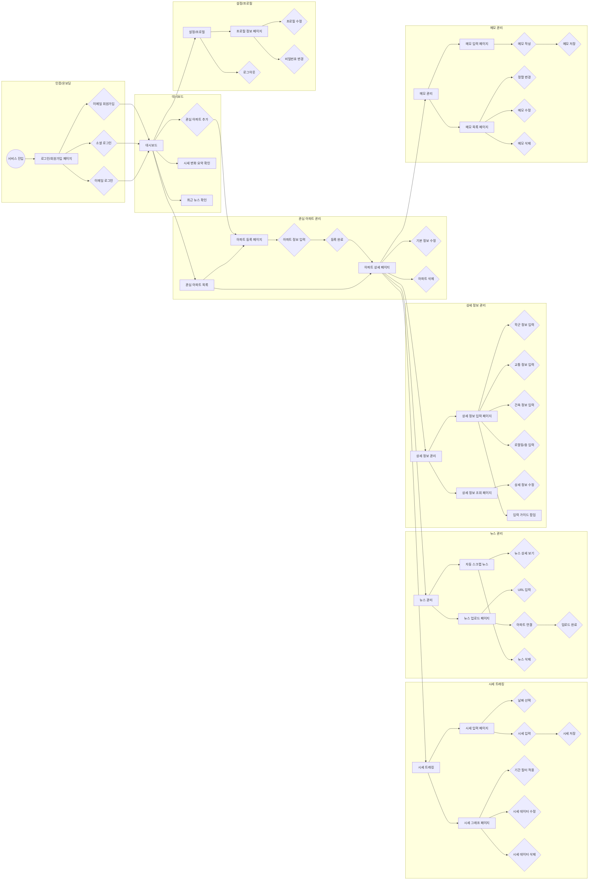

```mermaid
flowchart LR

  subgraph s1 ["인증/온보딩"]
    n1(("서비스 진입"))
    n2["로그인/회원가입 페이지"]
    n3{"이메일 회원가입"}
    n4{"소셜 로그인"}
    n5{"이메일 로그인"}
  end

  subgraph s2 ["대시보드"]
    n6["대시보드"]
    n7{"관심 아파트 추가"}
    n8["시세 변화 요약 확인"]
    n9["최근 뉴스 확인"]
  end

  subgraph s3 ["관심 아파트 관리"]
    n10["관심 아파트 목록"]
    n11["아파트 등록 페이지"]
    n12{"아파트 정보 입력"}
    n13{"등록 완료"}
    n14["아파트 상세 페이지"]
    n15{"기본 정보 수정"}
    n16{"아파트 삭제"}
  end

  subgraph s4 ["시세 트래킹"]
    n17["시세 트래킹"]
    n18["시세 입력 페이지"]
    n19{"날짜 선택"}
    n20{"시세 입력"}
    n21{"시세 저장"}
    n22["시세 그래프 페이지"]
    n23{"기간 필터 적용"}
    n24{"시세 데이터 수정"}
    n25{"시세 데이터 삭제"}
  end

  subgraph s5 ["상세 정보 관리"]
    n26["상세 정보 관리"]
    n27["상세 정보 입력 페이지"]
    n28{"학군 정보 입력"}
    n29{"교통 정보 입력"}
    n30{"건축 정보 입력"}
    n31{"로얄동/층 입력"}
    n32["상세 정보 조회 페이지"]
    n33{"상세 정보 수정"}
    n34["입력 가이드 팝업"]
  end

  subgraph s6 ["뉴스 관리"]
    n35["뉴스 관리"]
    n36["자동 스크랩 뉴스"]
    n37{"뉴스 상세 보기"}
    n38["뉴스 업로드 페이지"]
    n39{"URL 입력"}
    n40{"아파트 연결"}
    n41{"업로드 완료"}
    n42{"뉴스 삭제"}
  end

  subgraph s7 ["메모 관리"]
    n43["메모 관리"]
    n44["메모 입력 페이지"]
    n45{"메모 작성"}
    n46{"메모 저장"}
    n47["메모 목록 페이지"]
    n48{"정렬 변경"}
    n49{"메모 수정"}
    n50{"메모 삭제"}
  end

  subgraph s8 ["설정/프로필"]
    n51["설정/프로필"]
    n52["프로필 정보 페이지"]
    n53{"프로필 수정"}
    n54{"비밀번호 변경"}
    n55{"로그아웃"}
  end

  n1 --> n2
  n2 --> n3
  n2 --> n4
  n2 --> n5
  n3 --> n6
  n4 --> n6
  n5 --> n6
  n6 --> n7
  n6 --> n8
  n6 --> n9
  n6 --> n10
  n7 --> n11
  n10 --> n11
  n11 --> n12
  n12 --> n13
  n13 --> n14
  n10 --> n14
  n14 --> n15
  n14 --> n16
  n14 --> n17
  n17 --> n18
  n18 --> n19
  n18 --> n20
  n20 --> n21
  n17 --> n22
  n22 --> n23
  n22 --> n24
  n22 --> n25
  n14 --> n26
  n26 --> n27
  n27 --> n28
  n27 --> n29
  n27 --> n30
  n27 --> n31
  n26 --> n32
  n32 --> n33
  n27 --> n34
  n14 --> n35
  n35 --> n36
  n36 --> n37
  n35 --> n38
  n38 --> n39
  n38 --> n40
  n40 --> n41
  n36 --> n42
  n14 --> n43
  n43 --> n44
  n44 --> n45
  n45 --> n46
  n43 --> n47
  n47 --> n48
  n47 --> n49
  n47 --> n50
  n6 --> n51
  n51 --> n52
  n52 --> n53
  n52 --> n54
  n51 --> n55
```
